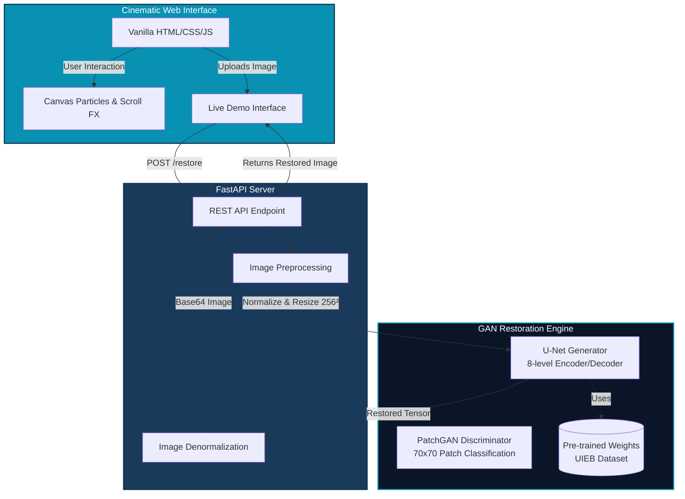

# AquaRestore 🌊

**🚀 Live Demo: [https://aquarestore.vercel.app/](https://aquarestore.vercel.app/)**

AquaRestore is an advanced, AI-powered underwater image restoration platform. It utilizes a custom GAN architecture (U-Net Generator + PatchGAN Discriminator) trained on the UIEB dataset to correct color distortion, haze, and low-contrast artifacts inherent in underwater photography.

The project features a high-performance Python/FastAPI backend for real-time GAN inference and a cinematic, multi-page "Deep Ocean Science" frontend built with vanilla HTML/CSS/JS, featuring high-end scroll animations and interactive canvas elements.

---

## 📐 Architecture & Pipeline



---

## 🚀 Features

- **Cinematic Frontend:** A multi-page experience (`/index.html`, `/how-it-works.html`, `/demo.html`) featuring:
  - Complex scroll-driven SVG animations (e.g., AUV-7 Submarine).
  - High-performance Canvas-based particle systems.
  - Interactive Before/After image comparison slider.
- **GAN-Powered Core:** Pix2Pix-style conditional GAN.
  - **Generator:** U-Net architecture preserving high-frequency spatial details via skip connections.
  - **Discriminator:** PatchGAN classifier evaluating realism on 70×70 overlapping patches.
- **Real-World Training:** Model trained on 890 real-world paired underwater images from the UIEB dataset, learning real physics rather than synthetic degradation.

---

## 💻 Tech Stack

- **Frontend:** Vanilla HTML5, CSS3 (Custom properties, grid/flexbox), Vanilla JavaScript (ES6+), Canvas API, Inline SVGs.
- **Backend:** Python, FastAPI, Uvicorn, Pillow (PIL), Base64.
- **Machine Learning:** PyTorch, Torchvision.

---

## 🛠️ Local Development

### 1. Backend (FastAPI + PyTorch)

Ensure you have Python 3.8+ installed.

```bash
cd backend
python -m venv venv
source venv/bin/activate  # On Windows use `venv\Scripts\activate`
pip install -r requirements.txt

# Run the FastAPI server
uvicorn main:app --reload --port 8000
```
The API will be available at `http://localhost:8000`. Swagger UI docs at `http://localhost:8000/docs`.

### 2. Frontend (Static Website)

The frontend does not require a build step (no Node.js/npm required). Simply serve the static files in the `website/` directory.

```bash
cd website

# Using Python's built-in HTTP server
python -m http.server 3000
```
Visit `http://localhost:3000` in your browser. The live demo page will automatically communicate with the backend running on port 8000.

---

## 👤 Author

**Built by Namish Rathy**
- 📧 Contact: namishrathy26@gmail.com
- 🔗 LinkedIn: [Namish Rathy](https://www.linkedin.com/in/namish-rathy/)

---
*AquaRestore — AI-powered underwater image restoration for marine research, defense, and deep sea discovery.*
